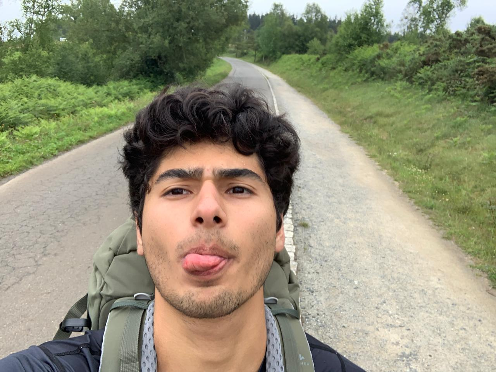

<!-- Main -->

<!-- One -->
<section id="one">
	

		<header class="major">
			<h1>Sobre Mí</h1>
		</header>

		

			

				
			

			

				 

				Soy Fernando Barba Pérez y soy una persona íntegra. Soy estudiante de las carreras de Actuaria y de Ciencia de Datos porque las aplicaciones ante la combinación de prevención de riesgos y análisis de datos masivos no tienen límites. Me apasiona aprender cosas nuevas, ya sea que mis profesores, padres o coaches me enseñen en la teoría, o yo lo vaya aprendiendo a través de la experiencia y los errores.
         			

          			

            			Además de lo académico, paso una gran parte de mi día haciendo ejercicio. Juego voleibol desde hace tres años y he representado a la Ciudad de México a nivel Macrorregional dos años consecutivos. También estuve en el equipo representativo de atletismo de mi preparatoria y gané competencias el tiempo que fue presencial. Ahora me estoy preparando para correr el maratón de la Ciudad de México.
			          

			          

            			Adicionalmente, lidero y coordino un equipo de 28 estudiantes para brindar apoyo a una comunidad marginada al norte de Puebla, el cual desde que entré, ha habido un incremento de participación de más de 250%. Al mismo tiempo, doy clases de economía a otros estudiantes y he dado clases de matemáticas básicas a niños de escasos recursos. 
	       			

			          

			        También amo cocinar y probar recetas nuevas, en especial si es con mis amigos o con mi madre. Soy fanático de los juegos de mesa, en especial aquellos que mezclan la interacción social con estrategia como Twilight Imperium, Spirit Island, Root, Pandemic o Gloomhaven. Me encanta viajar, ya sea con amigos, familia o solo con mis hermanos. Adoro caminar, tanto así que hice el Camino de Santiago el año pasado. 
			          

			          

			        Creo que es difícil resumir a una persona en pocas palabras. Sin embargo, este es un pequeño vistazo de mí, un nerd apasionado por aprender, crecer y explorar, dentro y fuera de la escuela.
